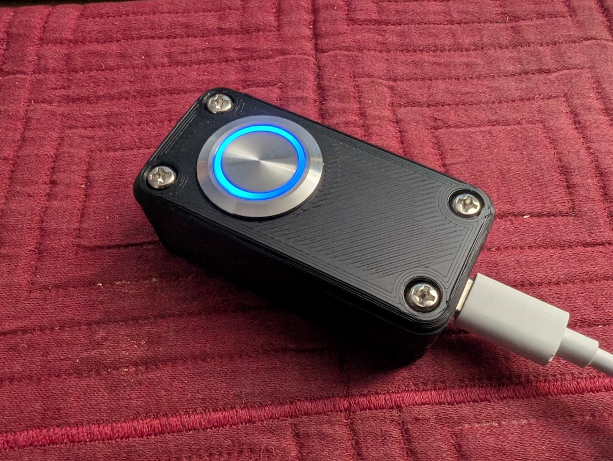
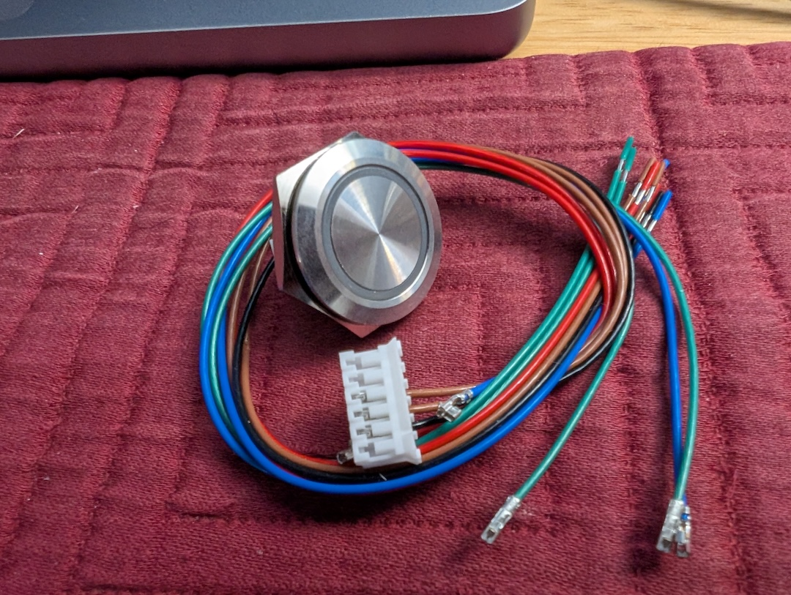

# esphome_led_button
3-color LED button + ESPHome + Home Assistant

## Components:
* [Waveshare ESP32-S3-Zero dev board](https://www.waveshare.com/esp32-s3-zero.htm)
* [FILN Momentary Push Button Switch](https://a.co/d/8b1aQwW)

 
  

## Wiring diagram

The lighted button's color-coded leads are NEGATIVE. So, despite the black lead's misleading color, it needs to be connected to 5V (3V3 will also work but the LED ring will be dimmer).

In order to protect the gpio pins from receiving too much current, a 220Ω resistor should be added between the color-coded lead and its gpio pin.

I wired RGB to GPIO9, 8, 7.

Note: I ended up not using the red channel because the red ring would flicker dimly even when the gpio pin was supposed to be blocking ground. Might have needed a different resistor for the red lead or perhaps noise on the gpio pin? I also should have tried other pins to see if it was particular to GPIO9.

The two brown leads provide the momentary switch action; when the button is pressed, current can flow from one brown lead to the other.

One brown lead was connected to GND and the other to GPIO10.

## 3d printed enclosure
Designed in FreeCAD.

* FreeCAD file

