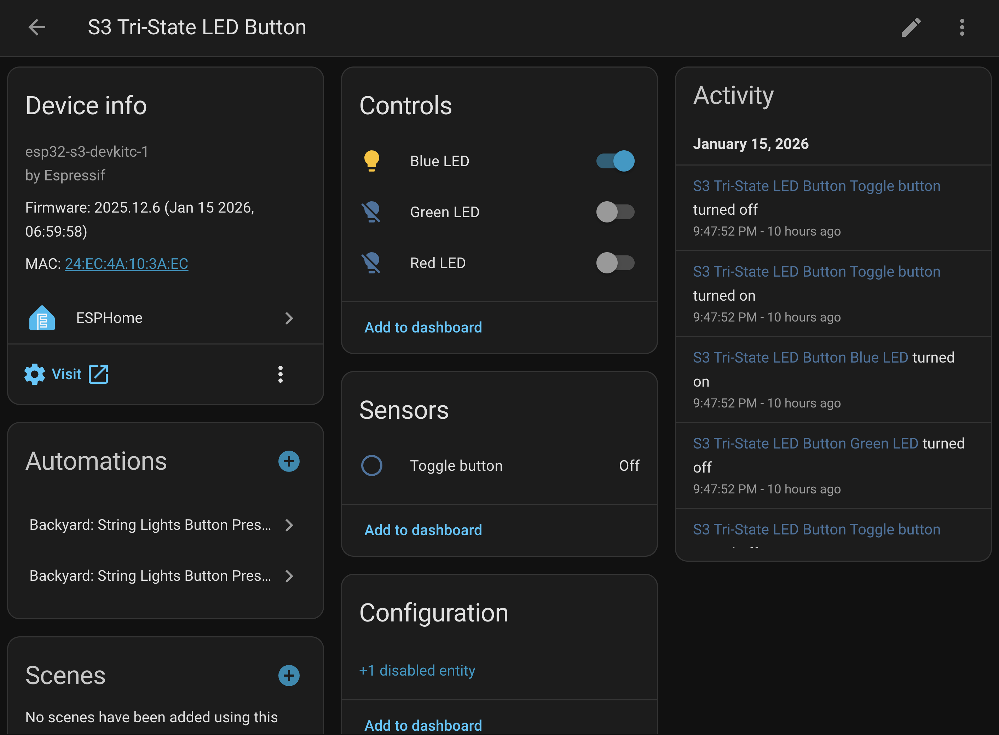
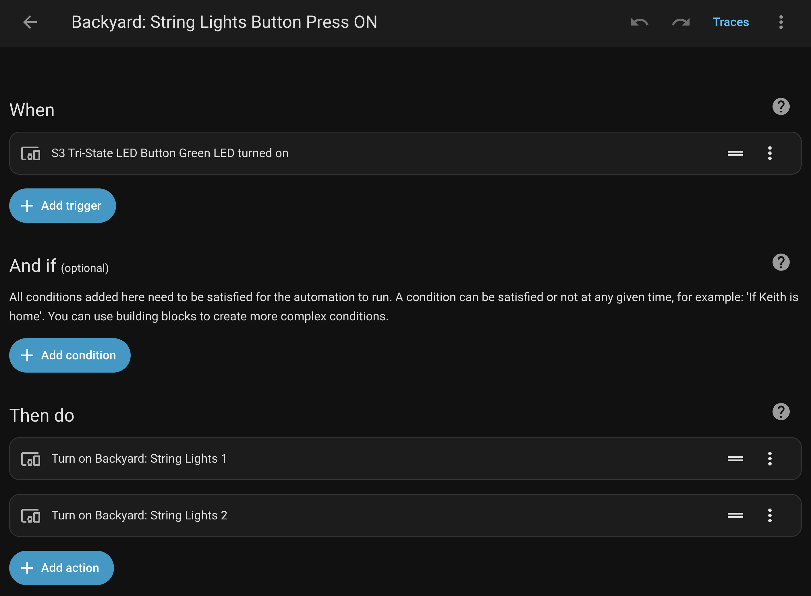

# esphome_led_button
3-color LED button + ESPHome + Home Assistant

Inspired by / adapted from [this reddit post](https://www.reddit.com/r/homeassistant/comments/1gc63nb/making_custom_buttons_with_esphome/)

## Components:
* [Waveshare ESP32-S3-Zero dev board](https://www.waveshare.com/esp32-s3-zero.htm)
* [FILN Momentary Push Button Switch](https://www.amazon.com/dp/B0FN6W43G8)

 

## Wiring diagram

The lighted button's color-coded leads are NEGATIVE. So, despite the black lead's misleading color, it needs to be connected to 5V (3V3 will also work but the LED ring will be dimmer). Turning one of the LED rings ON means a connected gpio pin needs to allow current to flow to ground.

See [this](https://www.reddit.com/r/esp32/comments/1ek18m3/is_it_possible_to_make_gpio_pin_work_as_ground/) for more details.

In order to protect the gpio pins from receiving too much current, a 220Ω resistor should be added between the color-coded lead and its gpio pin.

I wired RGB to GPIO9, 8, 7.

Note: I ended up not using the red channel because the red ring would flicker dimly even when the gpio pin was supposed to be blocking ground. Might have needed a different resistor for the red lead or perhaps noise on the gpio pin? I also should have tried other pins to see if it was particular to GPIO9.

The two brown leads provide the momentary switch action; when the button is pressed, current can flow from one brown lead to the other.

One brown lead was connected to GND and the other to GPIO10.

## 3d printed enclosure
[enclosure/README.md](enclosure/README.md)

## ESPHome YAML
Start by creating your own new ESPHome skeleton device so that your yaml will have api encryption key and passwords configured for your custom setup.

Then paste those values over the relevant sections ("`auto-generate-your-own-values`") in [s3-tri-state-led-button.yaml](s3-tri-state-led-button.yaml).

In my script the default state is to have the blue LED ring lit. When the button is pressed, I'll have Home Assistant turn on my backyard lights and the button's LED ring will change to green. When the button is pressed again to turn off the backyard lights, the LED ring will return to blue.

## Home Assistant configuration
This part is easy.

Add the new ESPHome device. You should be able to see the button's status and manually control its LED behavior.

You can then create a new automation that watches for state changes on the button.

I opted to set it up to follow the state of the green LED.

This automation triggers my backyard lights on. A similar entry turns them off.

