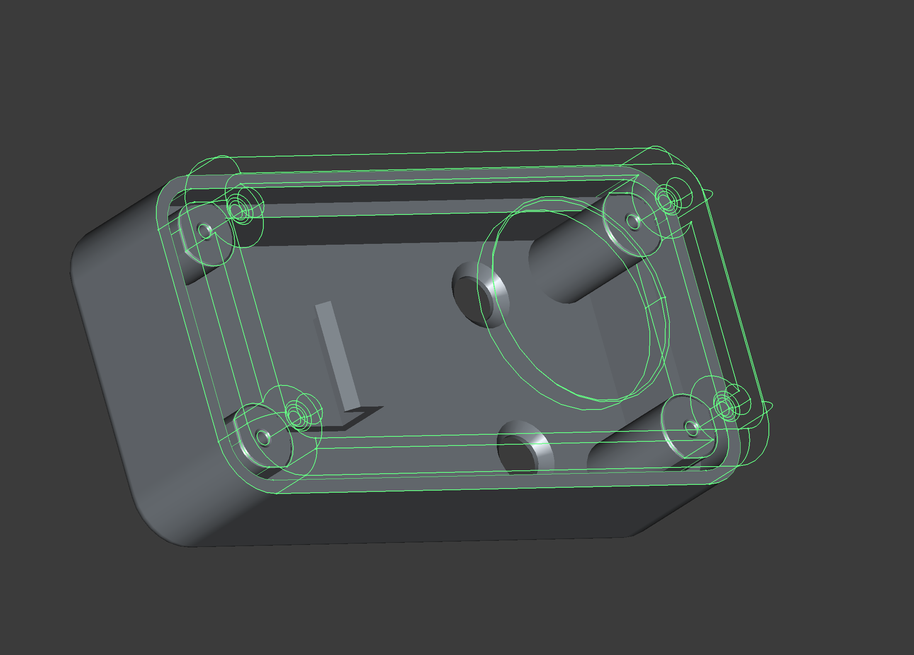
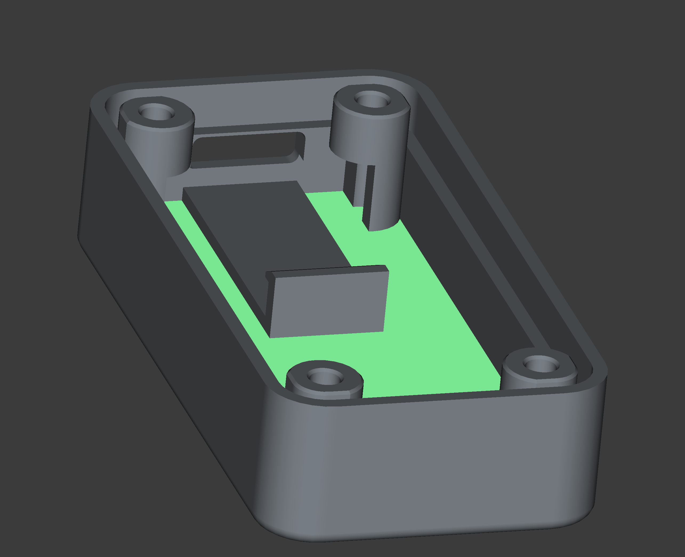
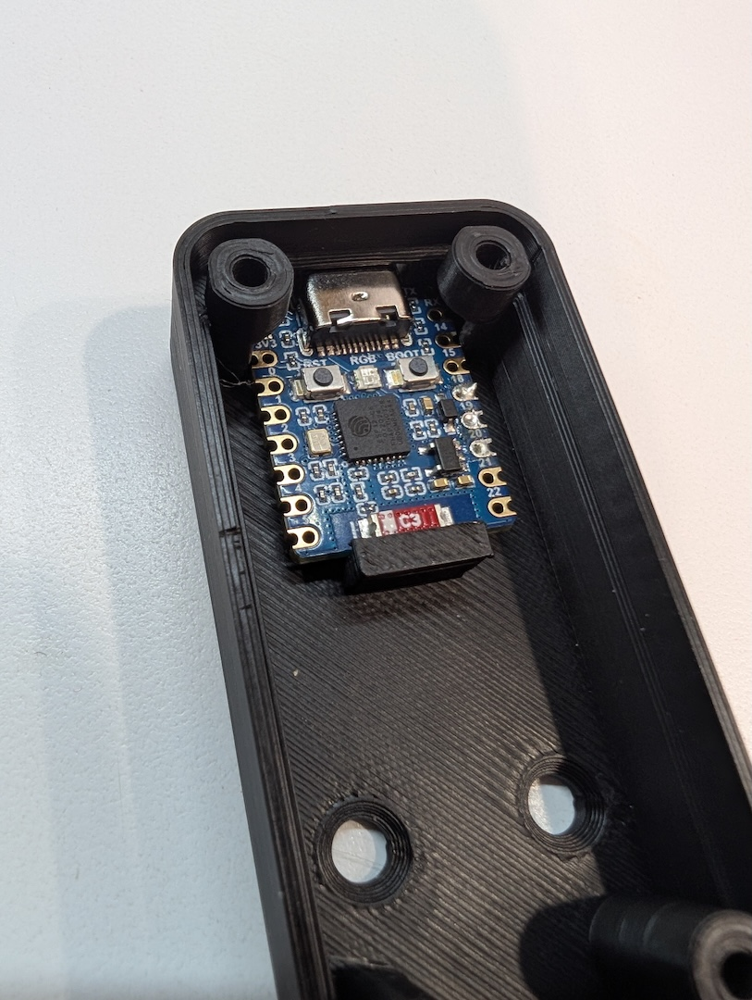

# 3d Printer Files

The enclosure has a small platform that holds the S3 Zero in place.

 

There are also two holes in the back for optional wall mounting.

### To print the enclosure:
Directly import to Orca Slicer or Bambu Studio:
* [Enclosure 3MF file](waveshare_s3_zero_button_enclosure.3mf)

STLs:
* [Enclosure top](waveshare_s3_zero_button_enclosure-top.stl)
* [Enclosure bottom](waveshare_s3_zero_button_enclosure-bottom.stl)

### To modify the design:
* [FreeCAD full design file](waveshare_s3_zero_button_enclosure.FCStd)
